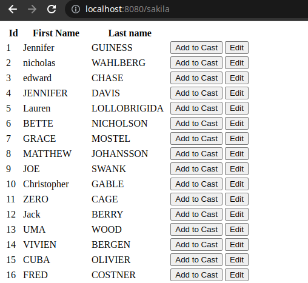
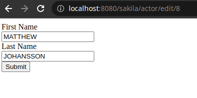
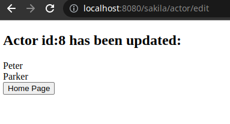
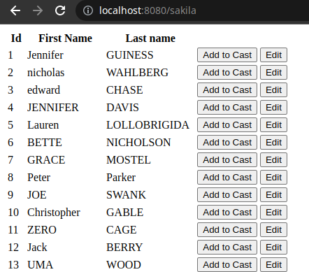
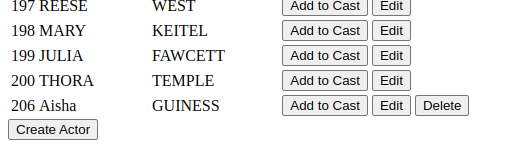
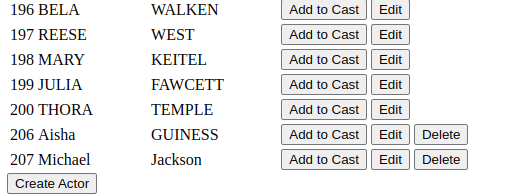
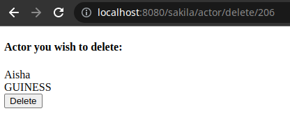
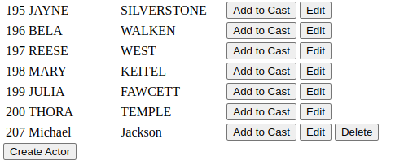
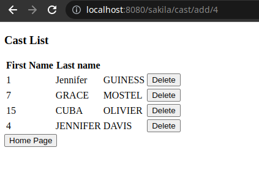

# Sakila Web

A simple web application that performs CRUD techniques on a SQL database utilising
Spring Boot, Hibernate and Thymeleaf.

---
### READ

### UPDATE

### CREATE 

### DELETE

---

### Cast List
With every session you can add actors to a cast list where you can also remove 
them from the cast list. This resets with every session.
